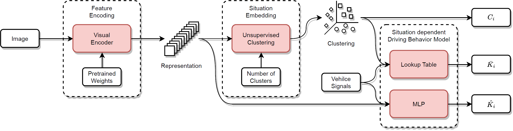
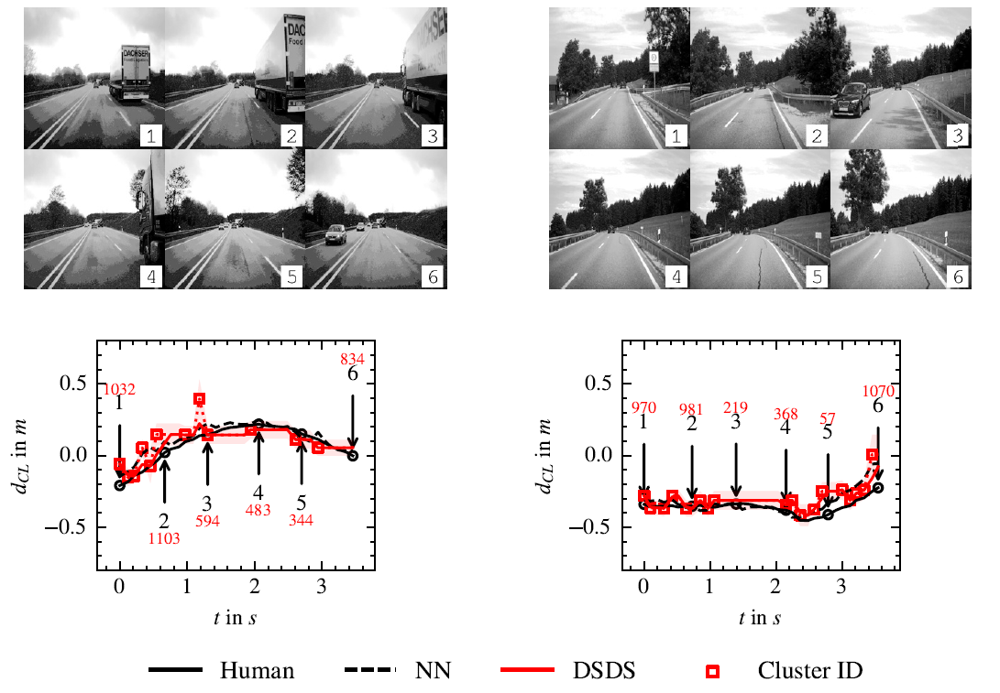

# SADC - Situation Awareness for Driver-Centric Driving Style Adaptation
This is the original implementation of the paper: "Situation Awareness for Driver-Centric Driving Style Adaptation"

[](https://arxiv.org/abs/2403.19595)

## Abstract
There is evidence that the driving style of an
autonomous vehicle is important to increase the acceptance
and trust of the passengers. The driving situation has been
found to have a significant influence on human driving behavior.
However, current driving style models only partially incorporate
driving environment information, limiting the alignment between
an agent and the given situation. Therefore, we propose a
situation-aware driving style model based on different visual
feature encoders pretrained on fleet data, as well as driving
behavior predictors, which are adapted to the driving style of a
specific driver. Our experiments show that the proposed method
outperforms static driving styles significantly and forms plausible
situation clusters. Furthermore, we found that feature encoders
pretrained on our dataset lead to more precise driving behavior
modeling. In contrast, feature encoders pretrained supervised
and unsupervised on different data sources lead to more specific
situation clusters, which can be utilized to constrain and control
the driving style adaptation for specific situations. Moreover,
in a real-world setting, where driving style adaptation is happening iteratively, we found the MLP-based behavior predictors
achieve good performance initially but suffer from catastrophic
forgetting. In contrast, behavior predictors based on situation-
dependent statistics can learn iteratively from continuous data
streams by design. Overall, our experiments show that important information for driving behavior prediction is contained
within the visual feature encoder.

The dataset is publicly available at [https://huggingface.co/datasets/jHaselberger/SADC-Situation-Awareness-for-Driver-Centric-Driving-Style-Adaptation](https://huggingface.co/datasets/jHaselberger/SADC-Situation-Awareness-for-Driver-Centric-Driving-Style-Adaptation).



## Citation
If you use or build upon our work, please cite us with:
```
@misc{haselberger2024situation,
      title={Situation Awareness for Driver-Centric Driving Style Adaptation}, 
      author={Johann Haselberger and Bonifaz Stuhr and Bernhard Schick and Steffen Müller},
      year={2024},
      eprint={2403.19595},
      archivePrefix={arXiv},
      primaryClass={cs.CV}
}
```

## Sample Predictions


## Setup
We provide a docker image on https://hub.docker.com/.
You can pull it with:
```sh
docker pull johannhaselberger/sadc
docker image tag johannhaselberger/sadc sadc
```

Alternatively you can build the Docker Image with:
```sh
docker build -f Dockerfile -t sadc .
```

## Prepare the Dataset
We provide the download script `download_dataset.py` to fetch the data from hugginface.co and store the image frames and DataFrames.

To download the training subset $\mathcal{D}_{P,T}$ of the pretrain dataset $\mathcal{D}_{P}$, issue the following commands:
```sh
docker run -it --rm -v $PWD:/root/sadc -w /root/sadc sadc

cd utils
python download_dataset.py --target_dir ../data --split pretrain_train
```

To download all splits ($\mathcal{D}_{P,T}$, $\mathcal{D}_{P,V}$, $\mathcal{D}_{V,T}$, and $\mathcal{D}_{V,V}$) for the experiments conducted in the paper:
```sh
docker run -it --rm -v $PWD:/root/sadc -w /root/sadc sadc

cd utils
python download_dataset.py --target_dir ../data --split pretrain_train
python download_dataset.py --target_dir ../data --split pretrain_val
python download_dataset.py --target_dir ../data --split val_train
python download_dataset.py --target_dir ../data --split val_val
```

## (Optional) WandB Configuration
You can enable [WandB](https://wandb.ai/site) logging for the individual runs of the visual feature encoders and NN-based behavior predictors 
by setting `use_wandb=True` and `wandb_api_key` to your personal api_key in the corresponding configs file in `NN/configs`.


## I) Train a Visual Feature Encoder on the Pretrain Dataset
To train for example the ResNet-18 visual feature encoder on our rural_only dataset set `--cpus` (and `--shm-size`) for your machine and run:
```sh
docker run -it --rm --gpus all --cpus 255 --shm-size=64G --ipc=host -v $PWD:/root/sadc -w /root/sadc sadc python -u NN/encoder_pretrain.py /root/sadc/NN/configs/resnet18/rural_only/r1/encoder_pretrain.yaml
```

## II) Infer the Representations with the Visual Feature Encoders
### Pretrained on our Dataset in Step I)
To infer representations for all datasets for example with the ResNet-18 visual feature encoder set `--cpus` (and `--shm-size`) for your machine and run:
```sh
docker run -it --rm --gpus device=0 --cpus 255 --shm-size=64G --ipc=host -v $PWD:/root/sadc -w /root/sadc sadc python -u NN/encoder_infer.py  /root/sadc/NN/configs/resnet18/rural_only/r1/encoder_infer.yaml
```

### Pretrained on ImageNet
To infer representations for all datasets for example with a ResNet-18 visual feature encoder pretrained on ImageNet1k set `--cpus` (and `--shm-size`) for your machine and run:
```sh
docker run -it --rm --gpus device=0 --cpus 255 --shm-size=64G --ipc=host -v $PWD:/root/sadc -w /root/sadc sadc python -u NN/encoder_infer.py  /root/sadc/NN/configs/resnet18_imagenet1k_v1/encoder_infer.yaml
```

### Pretrained on curated data (DINOv2)
We refere to the [official implementation of DINOv2](https://github.com/facebookresearch/dinov2) to infer representations with visual feature encoder trained on currated data.

## III) Train the Behavior Predictors for the Validation Drivers

### NN-Based
To train NN-based behavior predictors on infered representations set `--cpus` (and `--shm-size`) for your machine and run:
```sh
docker run -it --rm --gpus device=0 --cpus 255 --shm-size=64G --ipc=host -v $PWD:/root/sadc -w /root/sadc sadc python -u NN/head_train_and_infer.py /root/sadc/NN/configs/resnet18/rural_only/r1/mlp_head_train.yaml
```
This example trains a MLP-based behavior predictor on the representations of the rural_only dataset infered with the ResNet-18 visual feature encoder pretrained on our dataset. 

Configs for all the other NN models presented in the paper can be found at `NN/configs`.

### DSC-Based
First, we need to train the clustering (in this example for ResNet-18) with:
```sh
docker run -it --rm --gpus device=0 -v $PWD:/root/sadc -w /root/sadc sadc

cd DSC/situation_clustering
conda run -n SADC --no-capture-output python cluster.py ./configs/val/all/ResNet/config_resnet_18_val.yaml 
```
We provide the respective configuration files for all models and dataset splits reported in our paper under `DSC/situation_clustering/configs`.

After training, we can directly get the predictions and evaluation results following the steps described in IV.  
Alternatively, the notebook `DSC/DSDS/train_and_eval_DSDS.ipynb` can be used to train the LUT iteratively and to visualize the cluster centroid-wise histograms or the predicted trajectories.

## IV) Validate the Predictions
To evaluate the predictions of a single run the `eval.py` script is used.
For example to get the result metrics for a DSC run: 
```sh
docker run -it --rm -v $PWD:/root/sadc -w /root/sadc sadc

cd evaluation
conda run -n SADC --no-capture-output python eval.py ./settings/val/clustering/settings_all.yaml $RUN_NAME
```
For the evaluation of multiple runs (e.g., for the k-fold validation), the script `generate_k_fold_report` can be used.
We provide the respective setting files for all models and dataset splits reported in our paper under `evaluation/settings`.


## V) Train the Behavior Predictors for the Validation Drivers iteratively
### NN-Based
To train behavior predictors iteratively (e.g., 10 steps) on the infer representations of for example with a ResNet-18 visual feature encoder pretrained on ImageNet1k set `--cpus` (and `--shm-size`) for your machine and run:
```sh
docker run -it --rm --gpus device=0 --cpus 255 --shm-size=64G --ipc=host -v $PWD:/root/sadc -w /root/sadc sadc python -u NN/head_train_and_infer_stepwise.py /root/sadc/NN/configs/resnet18_imagenet1k_v1/all/r1/mlp_head_train_stepwise_10.yaml
```
This example trains a MLP-based behavior predictor on all data. 

### DSC-Based
The notebook `DSC/DSDS/train_and_eval_DSDS.ipynb` can be used to train the LUT iteratively and to visualize the cluster centroid-wise histograms or the predicted trajectories.
